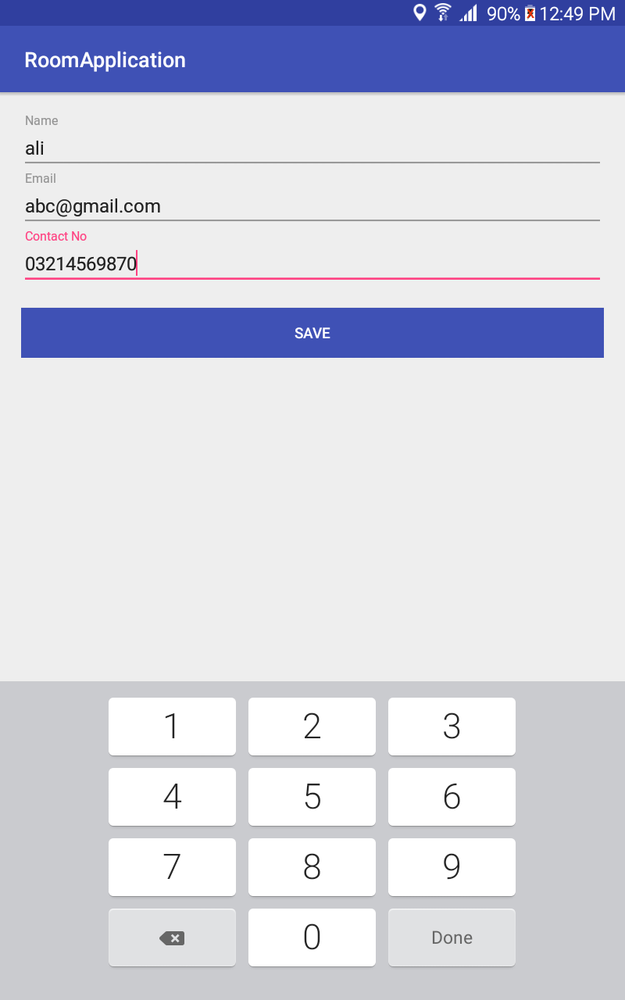
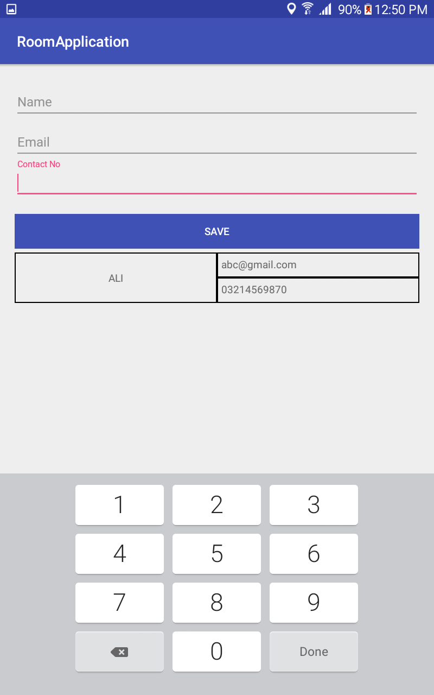
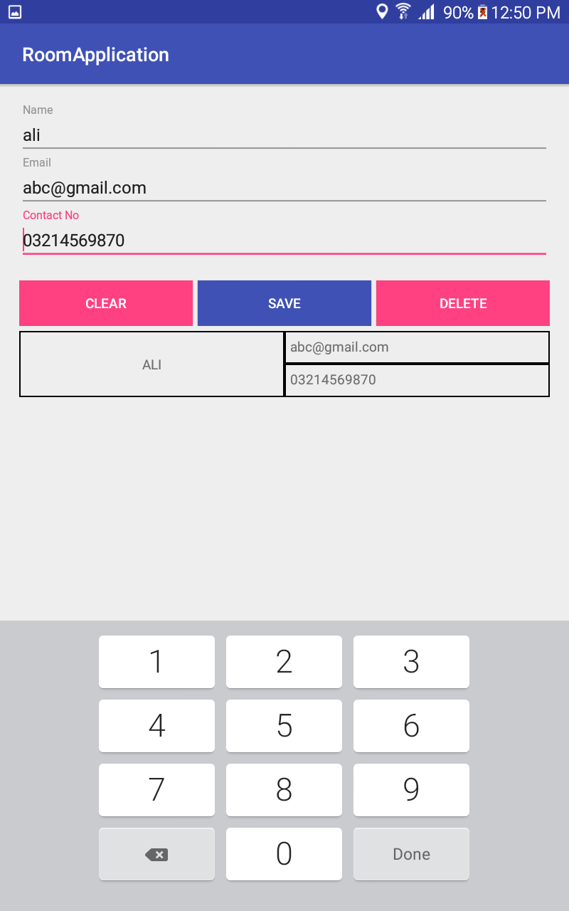

# DATA BINDING + ROOM

### DATA BINDING:
Whenever the developer wants to interact with the UI element, it can be achieved by infalating the Activity or Fragment layout, bind the UI element through findViewById or using ButterKnife binding technique and finally allocate the data value to element.

At Google I/O 2015, the new binding technology introduced called "DATA BINDING", which helps the developer to remove all boilerplate binding calls as well as having to manually update those views in the code.

##### Environment Setting:

- Add dataBinding element to your build.gradle file in the app module, which will enable data binding in your project.

```sh
android {
    ...
    dataBinding {
        enabled = true
    }
}
```

- Add <layout> root tag in your activity xml.

```sh
<?xml version="1.0" encoding="utf-8"?>
<layout xmlns:android="http://schemas.android.com/apk/res/android"
    xmlns:app="http://schemas.android.com/apk/res-auto"
    xmlns:tools="http://schemas.android.com/tools"
    tools:context="com.example.ali.roomapplication.ui.MainActivity">
    
    <LinearLayout
        android:layout_width="match_parent"
        android:layout_height="wrap_content"
        android:orientation="vertical"
        android:padding="20dp">
        
        <android.support.design.widget.TextInputLayout
            android:layout_width="match_parent"
            android:layout_height="wrap_content">
            <EditText
                android:id="@+id/txt_name"
                android:layout_width="match_parent"
                android:layout_height="wrap_content"
                android:hint="Name"
                android:text='@{data.name}' />
        </android.support.design.widget.TextInputLayout>
        
    </LinearLayout>
</layout>
```

For more info regarding data binding visit:
* [Data Binding](https://developer.android.com/topic/libraries/data-binding/index.html) - Data Binding Official documentation
* [Android Pub](https://android.jlelse.eu/android-data-binding-8d0eb34b9bad) - Descriptive intro of data binding

### ROOM (New approach to store data):

While building any data storage application that can store data in db by using some medium i.e abstraction layer. This layer can be the SQLiteOpenHelper class or ContentProvider class.
At Google I/0 2017 Room persistance library introduced, the new technique that can help to save data in SQLite database. Room provides enhanced security, easy access, easy to setup and quick to get started with new database. 

Three major components of Room:
- Database
- Entity
- DAO (Data Access Object)

If we talk about DML (Data Manipulation Language), all of the commands annotated like:
- @Insert
- @Update
- @Delete
- @Query (for select command)

##### Environment Setting:

- Add dependencies in your build.gradle file in the app module.

```sh
 compile "android.arch.persistence.room:runtime:1.0.0"
 annotationProcessor "android.arch.persistence.room:compiler:1.0.0"
```

- Add maven url in your build.gradle file in the project module.

```sh
allprojects {
    repositories {
        google()
        jcenter()
        maven { url 'https://maven.google.com' }
    }
}
```

For more info regarding Room visit:
* [Room](https://developer.android.com/training/data-storage/room/index.html) - Room Official documentation
* [Android Pub](https://android.jlelse.eu/room-store-your-data-c6d49b4d53a3) - Descriptive intro of room

### Working
It's a simple CRUD operation implement with Data Binding and Room. When inserting data it'll show in the list. If you want to update or delete any data, simply click on record that's populated in list, it'll fill the fields then you can perform update and delete operation.





### Contributors

Contributor: Ali Azaz Alam ali.azaz.alam@hotmail.com

License
----
The MIT License (MIT)
Copyright (c) 2017 Ali Azaz Alam.
